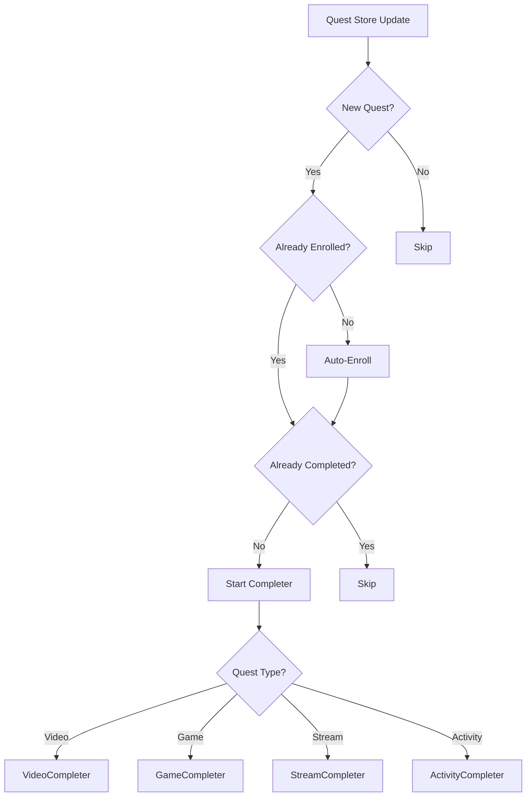

# OttoQuest - Auto-Complete

## Purpose

Automatically complete Discord quests (video, game, stream, activity) with zero user interaction.

## Business Rules

1. **Auto-Enrollment**: When a new quest is detected, automatically enroll if not already enrolled
2. **Auto-Completion**: Immediately start completing enrolled quests in the background
3. **Parallel Processing**: Complete multiple quests simultaneously without blocking each other
4. **Mobile Compatibility**: Convert mobile-only video quests to desktop-compatible format
5. **Graceful Recovery**: Resume in-progress quests after client restart

## Main Flows

### Quest Detection Flow

### Video Quest Completion Flow

1. Parse enrolled timestamp from quest
2. Calculate max allowable progress (enrolled time + 10s buffer)
3. POST to `/quests/{id}/video-progress` with timestamp
4. Increment timestamp by speed multiplier (default 7x)
5. Repeat until timestamp >= target duration
6. Send final completion request

### Game Quest Completion Flow

1. Fetch application data for quest game
2. Create fake game entry with spoofed process info
3. Inject into RunningGameStore via Flux dispatch
4. Subscribe to `QUESTS_SEND_HEARTBEAT_SUCCESS` for progress updates
5. On completion, remove fake game and unsubscribe

### Stream Quest Completion Flow

1. Create fake stream metadata with application ID
2. Inject into ApplicationStreamingStore
3. Subscribe to `QUESTS_SEND_HEARTBEAT_SUCCESS` for progress updates
4. Note: Requires at least 1 other person in voice channel

### Activity Quest Completion Flow

1. Find a valid channel ID (private channel or voice channel)
2. Construct stream key as `call:{channelId}:1`
3. POST heartbeats to `/quests/{id}/heartbeat` every 20 seconds
4. Continue until progress >= target

## Edge Cases

- **Quest Expires During Completion**: Stop completer, remove from tracking
- **Client Restart**: Re-detect in-progress quests and resume
- **Real Game Launched**: Stop fake game injection to prevent duplicate heartbeats
- **Unknown Quest Type**: Log warning and skip

## Test Flows

| ID | Scenario | Expected Result |
|----|----------|-----------------|
| TF-001 | Video quest detected | Auto-enrolls, starts video progress spoofing |
| TF-002 | Game quest detected | Auto-enrolls, injects fake game, heartbeats sent |
| TF-003 | Multiple quests active | All progress simultaneously |
| TF-004 | Quest completes | Notification shown, quest removed from tracking |
| TF-005 | Mobile-only quest | Converted to desktop format |
| TF-006 | Real game launched during fake | Fake game removed to prevent conflict |

## Definition of Done

- [ ] Auto-enrollment works for all quest types
- [ ] Video quests complete without manual intervention
- [ ] Game quests complete via process spoofing
- [ ] Stream quests complete via metadata spoofing
- [ ] Activity quests complete via heartbeat spoofing
- [ ] Multiple quests can run in parallel
- [ ] Notifications fire on completion (if enabled)
- [ ] Mobile quests converted to desktop format (if enabled)
- [ ] Plugin can be enabled/disabled cleanly
- [ ] Logs provide clear debugging information
